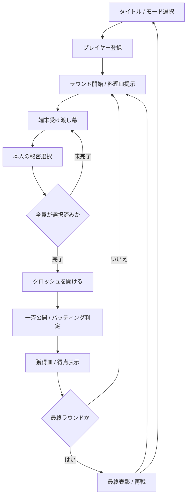

# ごちそう合戦 - Midnight Buffet 初期公開版 設計仕様

- 作成日: 2026-05-26
- 対象: GitHub Pages で公開する初期版
- 次期構想: Vercel + Supabase による合言葉ルーム型オンライン対応
- 次期仕様: [`2026-05-27-midnight-buffet-online-design.md`](./2026-05-27-midnight-buffet-online-design.md)
- ステータス: ユーザー承認済み（実装計画へ移行）

## 1. 目的

会社や親戚の集まりで、スマートフォン1台を順番に渡して遊べる短時間のパーティーゲームを制作する。プレイヤーは秘密に数字札を選び、全員の札が一斉に公開される瞬間の読み合い、バッティング、歓声や落胆を楽しむ。

初期版は静的 Web アプリとして GitHub Pages に公開する。将来的には Vercel と Supabase を使い、合言葉で同じ部屋へ参加し、各自の端末から秘密札を選ぶオンライン版へ発展させる。

## 2. 公開方針と権利境界

本作は市販カードゲームの公式デジタル版ではなく、独自作品 **『ごちそう合戦 - Midnight Buffet』** として公開する。

- 既存商品のタイトル、ロゴ、アート、カード意匠、説明文、用語、商品画像は使用しない。
- 表現面は独自の宴会ビュッフェ世界観、独自アート、独自 UI、独自テキスト、独自演出で構成する。
- 初期の遊びの核として、数字札の秘密選択、一斉公開、同値除外、良い皿と厄介皿の獲得判定を採用する。
- 広い配布や収益化を具体化する段階では、ルール近似を含めた公開リスクと必要な権利確認を再評価する。

## 3. 世界観辞書

### 3.1 ファンタジー

夜の高級ビュッフェ劇場で、招待客たちが最後のひと皿を狙う。豪華な料理を手にすれば喝采、厄介な皿を押し付けられれば笑いが起きる、上品だが少し騒がしい祝宴を描く。

### 3.2 ビジュアル語彙

| 領域 | 語彙とモチーフ |
| --- | --- |
| 背景 | 紺碧の宴会ホール、深紅のベルベット幕、暖かな燭台、磨かれた木と真鍮 |
| 主役オブジェクト | 金のクロッシュ、スポットライト下の配膳台、宝石のようなデザート、艶のある皿 |
| 厄介皿 | 焦げた料理、激辛の赤い湯気、崩れた盛り付け、不穏な煙 |
| HUD | 招待状や席札を思わせる細身の金枠、読みやすい明色文字 |
| 数字札 | ベルベットと金箔を感じる予約札、封蝋モチーフ |
| エフェクト | クロッシュの閃光、拍手の光粒、バッティング時の火花と沈黙の灰色化 |
| 文言 | 「乾杯」「配膳」「予約札」「ごちそう」「厄介皿」「もう一度乾杯」 |

### 3.3 避ける表現

- 市販作品の鳥、捕食、既存商品を想起させるロゴやカード図案。
- 子ども向けに偏った安価なカートゥーン表現。
- 高級感だけで判読性やタップ操作を犠牲にする暗すぎる画面。
- 料理アートを単純な CSS 図形だけで置き換える実装。

## 4. 対象プレイヤーと利用場面

- 対応人数: 2〜6人。
- 主利用場面: 会社の懇親会、親戚や家族の集まり、友人の食事会。
- 端末: まずは1台のスマートフォンを手渡して遊ぶ。
- 画面方向: 縦持ちを第一基準とする。
- 操作習熟: 初見でも短い案内で始められ、1ゲーム後に再戦したくなるテンポを目指す。

## 5. ゲームルール

### 5.1 モード

| モード | ラウンド数 | 用途 |
| --- | ---: | --- |
| ショート9皿 | 9 | すぐ試したい場、乾杯後の一戦 |
| フル15皿 | 15 | 読み合いを十分楽しむ本番 |

### 5.2 セットアップ

1. モードを選択する。
2. 2〜6人のプレイヤー名を登録する。
3. 各プレイヤーは `1` から `15` までの数字札を1枚ずつ手札として持つ。
4. モードに応じた枚数の料理皿デッキを用意し、1ラウンドにつき1枚を提示する。

料理皿デッキは以下の得点セットをラウンド開始前にランダムな順序へシャッフルする。

| モード | 良い皿 | 厄介皿 |
| --- | --- | --- |
| ショート9皿 | `+1` から `+6` までの6枚 | `-1` から `-3` までの3枚 |
| フル15皿 | `+1` から `+10` までの10枚 | `-1` から `-5` までの5枚 |

ショートモードでも手札は `1` から `15` のままとし、どの大きな札を短い勝負へ投入するかの迷いを残す。再戦時は料理皿の順序を再シャッフルする。

### 5.3 ラウンド進行

1. 中央の配膳台に今回の料理皿を表示する。
2. プレイヤーごとに端末を渡す幕画面を表示する。
3. 本人が手札を開き、使用可能な数字札を1枚選んで封蝋する。
4. 全員の選択が終わったら、共有画面に戻り `クロッシュを開ける` 操作を行う。
5. 全員の札を一斉公開し、同じ数字を選んだ札を判定対象から外す。
6. 良い皿は残った札の最高値のプレイヤーが獲得する。
7. 厄介皿は残った札の最低値のプレイヤーが獲得する。
8. 得点と獲得皿を更新し、次ラウンドへ進む。

判定対象となる札が存在しない場合、料理皿はそのラウンドで誰にも獲得されず、未配膳として記録する。この処理は演出上も明示し、得点を曖昧にしない。

### 5.4 終了と順位

- 全料理皿の配膳終了後、各プレイヤーの獲得皿の合計得点で順位を決める。
- 同点の場合は同順位とし、UI 上で共同優勝または同順位として表示する。
- 終了画面から同じ参加者・同じモードで即再戦できる。

## 6. 画面フロー

## 7. 画面設計

### 7.1 レイアウトアンカー

縦持ち画面では、位置を画面比率だけで固定せず、以下のアンカー関係を保つ。

- 上部: ラウンド、残り皿数、モード、音・演出設定を置く細い進行帯。
- 中央: 料理皿とクロッシュの主舞台。全画面で最優先の視覚領域とする。
- 下部: 本人が操作する数字札と確定 CTA。料理舞台との間に安全余白を確保する。
- 公開演出時: 料理舞台を基準に各プレイヤー札を周囲へ配置し、得点文言が皿や札へ重ならないようにする。

### 7.2 シーン別内容

#### タイトル / 設定

- ロゴ、宴会ホール背景、揺れる燭台、中央の金のクロッシュ。
- `ショート9皿` / `フル15皿` の選択。
- 参加人数と名前入力。
- 主 CTA: `祝宴を始める`。

#### 端末受け渡し

- ベルベット幕で秘密情報を完全に覆う。
- `次は {name} さん` と `端末を渡してください` を表示する。
- 本人のみが長押しで開ける操作を用意し、偶発的な覗き見を抑える。

#### 秘密選択

- 今回の料理皿を中央に表示し、正負の得点は文字と視覚の双方で判別可能にする。
- 数字札は下部に大きなタッチ領域で提示する。
- 札を選択して `この札を封蝋する` で確定する。
- 確定直後は選択札を隠し、次プレイヤーへの幕画面へ移る。

#### 一斉公開ショー

- 共有画面で `クロッシュを開ける` を押すまで札を伏せる。
- 開封時に料理皿と札を段階表示する。
- バッティング札は衝突エフェクトの後に判定対象外として灰色化する。
- 獲得者はスポットライト、料理の移動、得点増減のテキストで強調する。

#### 得点 / 最終表彰

- 参加者ごとの席札、合計点、獲得料理の小型表示を置く。
- 最終結果では優勝者または共同優勝者を祝宴の主役として表示する。
- `もう一度乾杯` と `設定へ戻る` を提供する。

## 8. 音・モーション・アクセシビリティ

- 効果音候補: ベル、クロッシュ開封、カード滑走、バッティング、獲得時の拍手、厄介皿時のどよめき。
- 音のオン/オフを常時操作可能にする。
- `prefers-reduced-motion` に追従し、アプリ内でも演出軽減を切り替え可能にする。
- 良い皿 / 厄介皿、得点増減、獲得者は色だけに依存せず、`+7` / `-4`、アイコン、短い説明で示す。
- 主要タップ対象はスマートフォン利用で押しやすいサイズを確保する。
- 受け渡し画面は手札、使用済み札、未公開選択を表示しない。

## 9. アセット方針

### 9.1 画像生成の対象

- タイトル画面用の夜会ホール背景。
- 中央舞台となる配膳台と金のクロッシュ。
- ごちそう皿と厄介皿の料理アート。
- 最終表彰用の祝宴イラストまたは装飾。
- 必要に応じて、カード裏面やベルベット幕の質感アセット。

料理、背景、主要舞台は生成画像を基準に設計し、粗い図形描画へ無断で縮退させない。数字、名前、得点、ボタン、可変メッセージは HTML テキストとして実装し、判読性とアクセシビリティを維持する。

### 9.2 実装前の画像基準

実装着手前に `390x844 portrait mobile` を対象とした基準 UI 画像を作成し、以下を確認する。

- 中央舞台、上部 HUD、下部の数字札が同時に読み取れる。
- 背景と料理アートが同一の祝宴語彙で成立する。
- 金や暗色の演出がテキストの可読性を損なわない。
- 実装に持ち込む要素、調整する要素、採用しない要素を記録する。

## 10. 技術設計

### 10.1 初期スタック

- React + TypeScript + Vite。
- 静的ビルドを GitHub Pages に配信する。
- UI は DOM 主体とし、生成画像をアセットとして利用する。
- カードやクロッシュ演出は CSS アニメーションを基本にし、要件上必要になった場合のみ軽量なモーション制御を追加する。
- 開発環境の実行、依存導入、ビルド、テスト、プレビューは Docker Compose コンテナ内で行う。

### 10.2 モジュール境界

| 境界 | 責務 |
| --- | --- |
| `game-domain` | デッキ定義、手札消費、同値除外、皿の獲得判定、得点、終了判定。UI や保存方式へ依存しない純粋ロジック。 |
| `local-session` | 1台回しの参加者、順番、秘密選択、画面フェーズ、再戦状態。 |
| `ui-scenes` | 設定、受け渡し、秘密選択、公開、得点、最終表彰の表示と操作。 |
| `assets/audio` | 画像メタデータ、効果音、ユーザー設定。 |
| `session-adapter` | 現在はローカルセッションを接続し、将来 Supabase セッションへ差し替え可能にする接続境界。 |

### 10.3 データフロー

1. UI がプレイヤー登録とモード選択を local session に渡す。
2. local session が domain の初期状態を作成する。
3. 秘密選択は現在のプレイヤー分だけ session に一時保持し、公開前は共有シーンに露出しない。
4. 全員選択後に domain が判定結果と次状態を算出する。
5. UI は判定結果を演出し、結果演出完了後に次ラウンドへ進む。

### 10.4 将来オンライン対応

次期版では Vercel に配信し、Supabase を用いて次を実現する。

- 合言葉による部屋作成と参加。
- 複数端末からの秘密札提出。
- ラウンド状態、公開タイミング、結果の同期。
- 再接続時の参加者状態復旧。

初期版で Supabase、認証、リアルタイム同期は実装しない。domain の判定 API と session-adapter 境界を保つことで、オンライン化時にゲームルールと視覚表現を再利用する。

## 11. エラー処理と異常系

- 参加人数が2人未満または6人超の場合は開始できず、入力付近へ理由を表示する。
- プレイヤー名が空または重複する場合は開始前に修正を求める。
- すでに使用した数字札は選択不可として明示する。
- 演出中の二重操作によるラウンド重複進行を防ぐ。
- 画像や音声がロードできない場合も、ゲーム判定とテキスト表示は継続できるようにする。
- ブラウザリロード後のゲーム復帰は初期版の必須要件に含めない。ゲーム中のリロード時は開始画面へ戻る仕様とし、将来の保存機能候補として残す。

## 12. 要件台帳

| ID | 要件 | 初期版での状態 |
| --- | --- | --- |
| REQ-001 | 独自作品『ごちそう合戦 - Midnight Buffet』として公開し、既存商品の名称・アート・文章・カード意匠を流用しない。 | 確定 |
| REQ-002 | 縦持ちスマホ中心の1台パスアンドプレイで、2〜6人が遊べる。 | 確定 |
| REQ-003 | 各プレイヤーは秘密に数字札を選び、全員入力後に一斉公開する。 | 確定 |
| REQ-004 | 同値札は判定から外れ、良い皿は残った最高値、厄介皿は残った最低値が獲得する。 | 確定 |
| REQ-005 | `ショート9皿` と `フル15皿` の2モード、最終順位、再戦導線を備える。 | 確定 |
| REQ-006 | 夜の高級ビュッフェ劇場の世界観で、生成画像、公開演出、効果音を用いた高品質な体験を作る。 | 確定 |
| REQ-007 | 受け渡し画面で秘密情報を隠し、本人以外へ手札と選択内容を露出しない。 | 確定 |
| REQ-008 | React + TypeScript + Vite で構築し、ルール判定を純粋ロジックとして分離し、GitHub Pages へ静的公開できる。 | 確定 |
| REQ-009 | Vercel + Supabase の合言葉ルーム対応を想定した `session-adapter` 境界を設ける。オンライン機能自体は初期版に含めない。 | 次期実装を見据えた初期設計要件 |
| REQ-010 | 音の ON/OFF、演出軽減、色に依存しない得点表示、十分なタッチ領域を備える。 | 確定 |

## 13. 要件差分表

本設計は初版要件台帳であるため削除要件はない。ユーザーの初期目標から初期リリースと将来リリースの境界を明文化した。

| 分類 | 内容 | 理由 / 影響 / 復帰条件 |
| --- | --- | --- |
| 維持 | スマホで遊ぶ、1台を渡すオフライン方式、リッチな仕上げ、GitHub Pages 初期公開。 | 初期リリースの中心価値として実装する。 |
| 維持 | 最終的に Vercel + Supabase で合言葉オンライン対応。 | 初期版では構造的な拡張余地を確保し、機能実装は次期へ分ける。 |
| 追加 | 独自タイトルと夜の高級ビュッフェ世界観。 | 公開可能な表現と体験品質を成立させるため。 |
| 追加 | 2〜6人、ショート9皿 / フル15皿、秘密選択と公開演出。 | 集まりでの利用場面とゲームテンポを具体化するため。 |
| 保留 | Supabase 部屋作成、合言葉参加、同期、再接続。 | 初期版の遊びを検証した後に実装する。復帰条件は GitHub Pages 版の操作検証完了とオンライン要件確定。 |
| 非対象 | 公式版表記、既存商品アセット・文章の再現。 | 独自公開作品として進めるため採用しない。 |

## 14. 非対象

- Supabase による部屋作成、合言葉参加、リアルタイム同期。
- アカウント登録、永続ランキング、課金、観戦、チャット。
- 市販作品の公式デジタル版を示す名称・表記・既存アセット再現。
- 横持ちやデスクトップを中心とした複雑な別レイアウト。
- 初期版でのゲーム途中の永続保存と復帰。

## 15. 受け入れ条件

### 機能

- 2〜6人の設定から、受け渡し、秘密選択、一斉公開、獲得判定、得点反映、終了、再戦まで実操作で完走できる。
- ショート9皿とフル15皿の両方が正しいラウンド数で終了する。
- 数字札 `1` から `15`、ショートの料理皿 `+1` から `+6` / `-1` から `-3`、フルの料理皿 `+1` から `+10` / `-1` から `-5` が正しく生成・消費される。
- 良い皿、厄介皿、同値除外、全札除外、同点最終順位をルールテストで確認する。
- 受け渡し中および確定後に、次プレイヤーへ秘密情報が表示されない。

### ビジュアルと操作

- 実装前に基準 UI 画像を作成し、採用する視覚方針を記録する。
- `390x844` と `430x932` の縦 viewport で、上部 HUD、料理舞台、札、CTA、得点結果に重なり・はみ出し・操作阻害がない。
- 画面比較では、世界観辞書の中核である宴会ホール、クロッシュ、料理、ベルベット、金の光、公開ショーが維持される。
- 音のオン/オフ、演出軽減、得点の色以外の識別手段が機能する。

### 技術と公開

- Docker Compose 内で依存導入、型チェック、テスト、ビルド、プレビュー確認を実行する。
- GitHub Pages のリポジトリ配下 URL で画像、音、ルーティングが壊れないビルド設定を備える。
- GitHub Pages の公開 URL は、GitHub リポジトリ作成・接続後に実配信を検証する。

## 16. リスクと対策

| リスク | 対策 |
| --- | --- |
| 既存ゲームに近いルールでの公開リスク | 名称、表現、UI、アート、説明文を独自化し、広い配布や収益化前に権利確認を再評価する。 |
| 端末受け渡し時の覗き見 | 幕画面、本人の長押し開封、選択確定直後のマスク、公開前の共有情報制限を実装する。 |
| リッチな画像でロードが重くなる | Web 向け形式と解像度へ最適化し、主要初回アセット容量を監視する。 |
| 派手な演出でテンポを損なう | 公開演出は短時間で完了し、演出軽減設定を用意する。 |
| 初期版からオンライン対応への作り直し | domain と session-adapter を分離し、初期 UI もセッション境界経由で状態を扱う。 |

## 17. 性能目標

- 初回ロードで必要な主要画像・音声アセットの転送量は合計おおむね 3 MB 以内を目標とする。
- 一般的なスマートフォンで、札の選択や確定操作に体感できる待ちを発生させない。
- クロッシュ開封から獲得者提示までの一斉公開演出は、通常設定で数秒以内に完結させる。
- 連続プレイ時に再読み込みを要求せず、終了画面から速やかに再戦開始できる。

## 18. 実装フェーズへの移行条件

1. 本仕様書についてユーザーレビューを受け、修正要否を確定する。
2. 実装計画を作成し、ルール値セット、アセット一覧、テスト項目、GitHub Pages 準備手順をタスク化する。
3. 基準 UI 画像を生成し、採用・調整・不採用の視覚判断を記録する。
4. その後に Docker ベースのアプリ構築と初期版実装へ進む。
